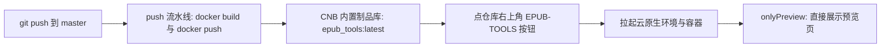

## 产品概述
依据仓库内教程文档 `CNB仅预览.md`（「CNB 仅预览模式 + 自定义启动按钮」），把教程落地为**本仓库**可直接使用的四份配置。目标是：访客在仓库页面右上角点一个按钮，不必进 IDE，直接看到「EPUB 工具箱」的环形首页。

## 核心功能
- 向 `master` 推送后自动构建镜像并推送到 CNB 内置制品库
- 仓库右上角出现名为 `EPUB-TOOLS` 的自定义启动按钮
- 点击按钮后拉起云原生环境与容器，以仅预览模式直接展示预览页
- 容器内应用监听 `0.0.0.0`，端口在镜像与启动命令之间保持一致

## 交付与边界（已确认）
- 本轮**先给出四份配置的完整内容**供审阅，确认后才写入仓库，本轮不落盘
- 仅配置主分支 `master`
- 不改动任何应用代码，不新增自动化测试脚本

## 需要你知道的两条后果
- `onlyPreview` 生效后，`master` 分支将**再也点不进 IDE**；以后要开发就另建 `dev` 分支（方案末尾给了配方）
- 容器内「选择文件夹」按钮会失效（依赖 tkinter），这是已存在的平台差异


## 技术栈
- 基础镜像：`python:3.12-slim`。`requirements.txt` 里的 Flask、beautifulsoup4、opencc 全部是预编译 wheel，**无需任何编译工具**，`pip install` 一步到位
- 配置载体：`Dockerfile`、`.dockerignore`、`.cnb.yml`、`.cnb/settings.yml`
- 平台内置变量：构建期用 `CNB_DOCKER_REGISTRY` 与 `CNB_REPO_SLUG_LOWERCASE`；云原生环境会自动注入 `CNB_API_ENDPOINT` / `CNB_REPO_SLUG` / `CNB_TOKEN`

## 实施思路
整条链路只有三段：**推送触发构建并推镜像** → **制品库里的镜像就绪** → **点按钮拉起容器并预览**。



### 关键决策与理由
1. **分支键用 `master`**：本仓库默认分支是 `master`，教程示例写的 `main` 直接用会完全不生效，这是最容易踩的坑。
2. **`launch` 里的镜像写成常量** `docker.cnb.cool/pluto_2026/epub_tools:latest`。教程特别警告：写成 `${CNB_DOCKER_REGISTRY}/${CNB_REPO_SLUG_LOWERCASE}` 会让别人 Fork 后解析到他们自己的仓库路径，而那边没有镜像，按钮必定启动失败。
3. **端口只在 Dockerfile 里定义一处**：应用读的是 `EPUB_TOOLS_PORT`（不是教程示例里的 `PORT`）。在镜像的 `ENV` 与 `EXPOSE` 里定为 `8686`，`launch` 就不再重复传，把「四处对齐」压缩成「两处一致」，少一个出错面。
4. **必须设 `EPUB_TOOLS_HOST=0.0.0.0`**：应用默认监听 `127.0.0.1`，容器里不改这一项，预览页永远连不上。
5. **`.dockerignore` 必须存在**：`.gitignore` 对 `docker build` 无效，`COPY . .` 会把 `.venv/`（几十 MB）和运行时产物一起打进镜像。但**不能排除 `sample_test.epub`**，它是 TXT 转 EPUB 的默认模板，`build_epub.py` 按工作目录解析它。
6. **镜像里不用 `启动.sh`**：那个脚本会创建 venv 并安装依赖，在镜像里纯属多余，直接 `CMD ["python", "app.py"]`。
7. **不透传 `CNB_TOKEN` 等凭证**：本应用当前不调用大模型，按最小权限原则不把令牌塞进容器。教程示例里之所以要传，是因为它的示例程序会调 LLM；等首页中央的 AI 入口真正接上时再加这三行。

### 执行要点（防回归）
- `launch` 写成**单行**，不用教程里的 `\` 续行。原因：YAML 的普通标量会把换行折成空格，而 `\` 在普通标量里只是字面字符，两种规则叠在一起要靠 shell 的转义凑巧生效，单行写法没有歧义。
- 确认 `.gitignore` **没有**忽略 `.cnb/`（已核对：现有规则只有 `/uploads/`、`/outputs/`、`/work/`、`/.build_*/`、`/.venv/`、`/venv/`，不影响），否则配置文件会被静默跳过提交。
- `runner.cpus` 用 4：本工具是很轻的 Flask 应用，教程的 16 核属于示例项目的配置，想照抄改回 16 即可。
- 制品库里的 `epub_tools` 镜像需要设为**公有**，否则访客和评委拉不到。

### 已知限制（本轮不改代码，仅记录）
- 容器内没有 Tk 也没有显示，「选择文件夹」必然失败并返回中文错误，用户改用「输出文件夹」文本框填写即可。
- EPUB 与 TXT 的产物写在容器内的 `outputs/`，容器回收后即消失，访客需要当场点下载链接。

## 目录结构

```
/workspace/
├── Dockerfile              # [新增] 业务镜像：装依赖、拷代码、声明 0.0.0.0 与 8686
├── .dockerignore           # [新增] 排除 .venv/ 与运行时产物，保留 sample_test.epub
├── .cnb.yml                # [新增] master.push 构建推送镜像 + $ 段仅预览启动
├── .cnb/
│   └── settings.yml        # [新增] 仓库右上角自定义启动按钮（EPUB-TOOLS）
├── app.py                  # [不改] 已支持 EPUB_TOOLS_HOST / EPUB_TOOLS_PORT
├── requirements.txt        # [不改] Flask / beautifulsoup4 / opencc
├── sample_test.epub        # [不改] 但必须打进镜像
├── 开发总结.md             # [修改] 记入本轮配置与踩坑
└── 其余代码与资源           # [不改] modules/ templates/ static/ web/ build_epub.py
```

## 四份配置完整内容

### 1. `Dockerfile`
```dockerfile
# EPUB 工具箱：CNB 仅预览模式使用的业务镜像
FROM python:3.12-slim

WORKDIR /app

# 先装依赖再拷代码：只改业务代码时，这一层能命中缓存
COPY requirements.txt ./
RUN pip install --no-cache-dir -r requirements.txt

COPY . .

# 关键：应用默认监听 127.0.0.1，容器里必须改成 0.0.0.0，否则预览连不上。
# 端口只在这里定义一处，launch 命令不再重复传，避免多处置不一致。
ENV EPUB_TOOLS_HOST=0.0.0.0 \
    EPUB_TOOLS_PORT=8686 \
    PYTHONUNBUFFERED=1

EXPOSE 8686

# 不用 启动.sh：它会创建 venv 并装依赖，在镜像里是多余的。
CMD ["python", "app.py"]
```

### 2. `.dockerignore`
```
# 不把虚拟环境、运行时产物与版本库信息打进镜像。
# 注意：.gitignore 对 docker build 无效，必须在这里显式排除。
.venv/
venv/
__pycache__/
*.pyc
*.pyo
.git/
.gitignore
.gitattributes
.codebuddy/
.Trash-0/
uploads/
outputs/
work/
.build_*/
*.md

# 以下必须保留，不要加进上面的列表：
# app.py、build_epub.py、requirements.txt、sample_test.epub、
# modules/、templates/、static/、web/
```

### 3. `.cnb/settings.yml`
```yaml
# 仓库右上角的自定义启动按钮，推送后即出现。
workspace:
  launch:
    button:
      name: EPUB-TOOLS
      # 可选：只想显示按钮名的话，把下面这行删掉即可。
      description: EPUB 瑞士军刀：元数据编辑、文本清洗、样式排版、拆分合并、简繁转换、EPUB 与 TXT 互转
```

### 4. `.cnb.yml`
```yaml
# 主分支推送时构建并推送业务镜像到 CNB 内置制品库。
# CNB_DOCKER_REGISTRY 与 CNB_REPO_SLUG_LOWERCASE 是平台内置变量，不需要自己填。
master:
  push:
    - stages:
        - name: build-and-push
          script: |
            docker build -t ${CNB_DOCKER_REGISTRY}/${CNB_REPO_SLUG_LOWERCASE}:latest .
            docker push   ${CNB_DOCKER_REGISTRY}/${CNB_REPO_SLUG_LOWERCASE}:latest
      services:
        - docker

# 仅预览模式：点右上角按钮后不进 IDE，直接拉起容器并展示预览页。
$:
  vscode:
    - runner:
        cpus: 4
      services:
        - docker
        - name: vscode
          options:
            onlyPreview: true
            # 镜像必须写成常量地址。若写成 ${CNB_DOCKER_REGISTRY}/${CNB_REPO_SLUG_LOWERCASE}，
            # 别人 Fork 后会解析到他们自己的仓库路径，而那里没有构建过镜像，启动必定失败。
            # 端口已由镜像的 ENV 带好（EPUB_TOOLS_PORT=8686），这里不必再传。
            # 以后若要让首页的 AI 入口调用 CNB 大模型，在这条命令里补上：
            #   -e CNB_API_ENDPOINT -e CNB_REPO_SLUG -e CNB_TOKEN
            launch: docker run -d --network host docker.cnb.cool/pluto_2026/epub_tools:latest
            keepAliveTimeout: 3600000
            daemon: true
```

## 推送后的验证清单
1. 推送后到「流水线 / 构建」页确认 `build-and-push` 是绿勾，并确认制品库里出现 `docker.cnb.cool/pluto_2026/epub_tools:latest`。
2. 把该镜像设为**公有**，否则访客拉不到。
3. 仓库右上角出现 `EPUB-TOOLS` 按钮。
4. 点按钮：应**不进 IDE**、直接展示预览页，看到环形首页（8 个圆形功能按钮加中央 AI 入口）。
5. 若预览页打不开或白屏，先看容器日志里是否有 `Running on http://0.0.0.0:8686`；没有就是监听地址或端口不对，改动点只有 Dockerfile 的 `ENV` 与 `EXPOSE` 两行。
6. 本地若装了 Docker，可先自行验证，比在平台上试错快得多：
   ```bash
   docker build -t epub-tools:local .
   docker run --rm -p 8686:8686 epub-tools:local
   # 浏览器打开 http://127.0.0.1:8686/
   ```
7. 想进 IDE：新建 `dev` 分支，在该分支提交一份**不带 `onlyPreview`** 的 `.cnb.yml`，内容为：
   ```yaml
   $:
     vscode:
       - runner:
           cpus: 4
         services:
           - vscode
           - docker
   ```
   在该分支页面点「云原生开发」即可进入；`master` 继续保留仅预览配置对外展示，两者互不影响。


## Agent Extensions
### Skill
- **cnb-pipeline**
  - Purpose: 编写并审查 `.cnb.yml` 的 `master.push` 构建推送段与 `$` 段仅预览启动配置，确认字段名与缩进符合 CNB 规范
  - Expected outcome: 产出可直接推送生效的 `.cnb.yml`，并指出任何会导致构建失败或配置不生效的写法
- **cnb-docs**
  - Purpose: 核对 `workspace.launch.button` 与 `onlyPreview`、`keepAliveTimeout`、`daemon` 等字段的当前写法，以及制品库公有的操作路径
  - Expected outcome: 给出字段名与文档一致的结论，并补全「推送后验证清单」里的平台侧操作步骤
