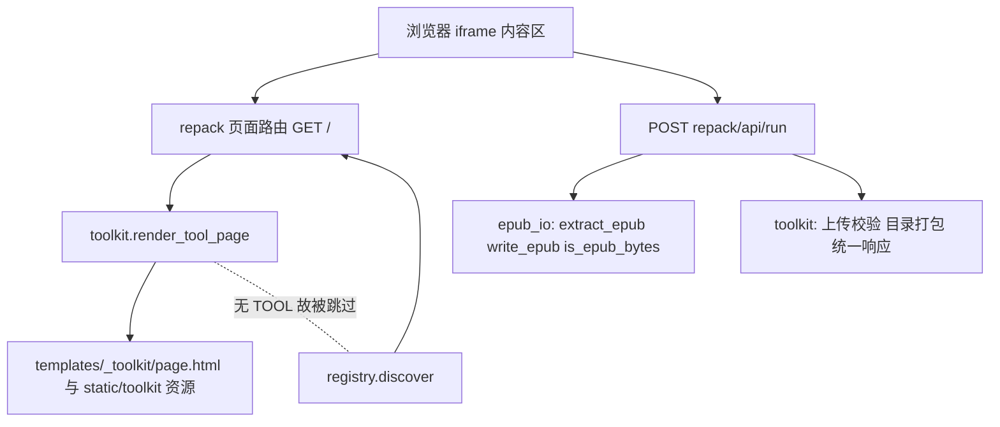

## Product Overview
在「EPUB 瑞士军刀」项目上推进第二步。按用户确认的节奏「一次只做一个」执行，本轮交付两件事：一是抽出一套**通用工具页面框架**（统一「上传 → 配置 → 处理 → 下载」），二是用它落地**首个工具「解包 / 重打包」**。新增内容不得改变既有 `txt2epub`、`notes` 两个工具的任何行为。

## Core Features
- **通用框架页**：由声明式配置驱动的统一工具页面，新工具只需提供一份页面配置与后端接口，不再各写一套 HTML/JS
- **模式切换**：同一页面内切换「解包 EPUB」与「重打包 ZIP」，上传控件、文案与提示随之切换
- **解包**：上传 EPUB，服务端解包后打包为 ZIP 下载，保留原始目录结构
- **重打包**：上传 ZIP，校验后生成规范 EPUB（`mimetype` 为首个且不压缩条目）下载
- **统一反馈**：处理中禁用按钮，成功以中文提示并给出下载入口，失败给出明确中文原因且不留半成品文件
- **统一错误处理**：非 EPUB/ZIP、文件损坏、超过 50MB、压缩包含不安全路径等场景均有中文说明

## 视觉与交互效果
页面为独立完整文档，嵌入现有左侧边栏的右侧 iframe 中，风格与既有工具保持一致：浅灰底、白色卡片、深色主按钮。自上而下依次为页头（标题＋副标题）、模式切换条、上传卡片、配置卡片（本轮为空占位，供后续工具填充）、操作按钮条、状态提示条、结果卡片（下载链接或预览区）。切换模式、按钮悬停与禁用态均有即时视觉反馈，窄屏下双列自动收为单列。


## Tech Stack Selection
沿用项目现有技术栈，不引入任何新依赖：
- 后端：Python 3.6+ + Flask（`Flask>=2.2,<4`）+ BeautifulSoup4（本轮仅复用，不新增用法）
- 前端：Jinja2 模板 + 原生 HTML/CSS/JS（无构建步骤）
- EPUB 处理：复用既有 `modules/epub_io.py`（仅标准库）
- 新增资源目录：`static/toolkit/`（Flask 默认 `/static` 静态路由，无需改 `app.py`）

## Implementation Approach
**策略**：先落「无 TOOL 的公共框架模块」，再由首个工具作为消费者验证端到端链路。

**为什么框架模块可以零改 `app.py`**：经核对 `modules/registry.py` 的 `_build_tool()`，模块没有 `TOOL` 字典时直接返回 `(None, None)` 被静默跳过（与 `epub_io.py` 同性质）。因此 `modules/toolkit.py` 天然不会被 `discover()` 注册，也无需任何装配代码。

**页面渲染方式**：采用「单一共享壳模板 + 声明式配置」。框架提供 `render_tool_page(page)`，工具只需在自身模块内声明 `PAGE` 字典并在 `GET /` 中调用它。壳模板 `templates/_toolkit/page.html` 把配置以 `tojson` 注入页面，由 `static/toolkit/toolkit.js` 动态渲染表单与结果区。这样「新工具只填配置」可真正落地，且避免在 Jinja 里堆砌字段分支逻辑。

**静态资源落点**：`Flask(__name__)` 在 `app.py` 位于项目根时 `root_path` 即 `/workspace`，默认 `static_folder="static"` 且 `/static` 路由在 Flask 初始化时无条件注册（不要求目录预先存在）。故新建 `/workspace/static/toolkit/` 即可通过 `/static/toolkit/...` 访问，完全不动 `app.py`。实施时用 `url_for('static', filename=...)` 引用，并在验证环节断言其返回 200；万一该隐式路由不可用，退路是让工具 blueprint 增加一条 `/_toolkit/<path:filename>` 静态路由并重定向引用。

**统一响应与「双响应」处理**：新框架约定 `{"ok": true, ...}` / `{"ok": false, "error": "..."}`（沿用 `txt2epub` 的键名，**不改动** `notes` 的 `success` 约定）。由于下载类接口需直接回传文件、JSON 类接口回传数据，前端 `toolkit.js` 按响应 `Content-Type` 分流：JSON 则按 ok/error 渲染状态与结果；非 JSON 则读取 `Content-Disposition` 取文件名并以 Blob 触发下载。此方案无需服务端保存下载任务与 TTL 状态，避免引入无谓的状态管理。

**首个工具的边界处理**：
- 解包：走 `epub_io.extract_epub`（其内部在落盘前整体校验成员路径，天然防目录穿越）→ 用 `toolkit.zip_directory` 打包为 ZIP，保留原结构，`download_name` 为 `<stem>.zip`
- 重打包：上传 ZIP → `is_epub_bytes` 校验 → 解包 → 若根目录下只有一个顶层文件夹且其中含 `mimetype` 或 `META-INF`，则下沉一层（扁平化）后再 `write_epub`，避免生成 `mimetype` 不在根目录的非法 EPUB
- `mimetype` 缺失或内容异常：由 `write_epub` 的内置回落逻辑补标准值
- 超 50MB：沿用全局 `MAX_CONTENT_LENGTH`，在 blueprint 上加 `413` 处理器返回统一中文错误
- 压缩炸弹防护：解包前累加 `ZipInfo.file_size`，超过阈值（512MB）直接拒绝，避免小体积上传撑爆磁盘

**性能与复杂度**：处理复杂度为 O(n)（n 为归档条目数），两次遍历（校验＋落盘）；内存占用受 50MB 上传上限与 512MB 展开上限双重约束；解包与重打包均使用 `tempfile.TemporaryDirectory()`，异常路径也自动清理，无残留。

**避免技术债**：不重写、不搬迁既有工具；不修改 `app.py`/`registry.py`/`epub_io.py`；`epub_io` 的公共函数被新工具直接复用而非复制粘贴。

## Architecture Design


## Implementation Notes
- **复用既有视觉令牌**：新 `toolkit.css` 直接沿用 `web/style.css` 的取值（底色 `#f5f6f8`、卡片白底圆角 12、边框 `#e1e5ea`、主按钮 `#20242a`、成功 `#eff8f1/#28683b`、错误 `#fff0f0/#a52a2a`、日志区 `#111827`），保证嵌入 iframe 后与既有工具观感一致。
- **错误信息一律中文**，且通过自定义异常 `ToolkitError` 与 `epub_io.EpubIOError` 捕获后转为统一 JSON，不向用户暴露堆栈。
- **文件名安全化**：下载名经 `toolkit.safe_filename` 处理（参考 `txt2epub.safe_epub_filename` 的字符清洗思路），防止响应头注入与非法字符。
- **影响面控制**：只新增文件；`Tool.as_dict()` 与侧边栏渲染逻辑不变，新工具靠既有 `TOOL` 约定自动出现在侧边栏（`order=30`，排在 `txt2epub`、`notes` 之后）。
- **可扩展点预留**：配置中的字段类型先支持 `text/select/checkbox/textarea/number/file`，结果区先支持「下载」与「HTML 预览」两种；后续「元数据编辑」「文本清洗/样式排版」无需再改框架。
- **本轮不做**：不迁移 `txt2epub`、`notes` 到新框架；不做校验修复/格式互转/批处理流水线；不引入新的第三方依赖。

## Directory Structure
```
workspace/
├── modules/
│   ├── toolkit.py                # [NEW] 通用工具页面框架（公共模块，无 TOOL，被 discover 自动跳过）。
│   │                             #   提供：PageConfig 数据类与页面配置校验；render_tool_page(page) 渲染共享壳；
│   │                             #   ok()/fail() 统一响应；ToolkitError 自定义异常；
│   │                             #   read_upload(name, suffixes) 上传校验与读取；zip_directory(root) 目录打包为 BytesIO；
│   │                             #   safe_filename(name) 下载名安全化。仅依赖标准库与 Flask。
│   └── repack.py                 # [NEW] 首个工具「解包 / 重打包」（TOOL: key=repack, order=30, url_prefix=/repack）。
│                                 #   GET / 渲染页面；POST /api/run 按 mode 分派解包/重打包；
│                                 #   含 413 处理器与中文错误转换；解包/重打包逻辑复用 epub_io。
├── templates/
│   └── _toolkit/
│       └── page.html             # [NEW] 共享页面壳：页头、模式切换、上传卡片、配置卡片、操作条、
│                                 #   状态条、结果卡片；以 tojson 注入页面配置；引用 /static/toolkit 资源。
├── static/
│   └── toolkit/
│       ├── toolkit.css           # [NEW] 框架样式，沿用既有视觉令牌；1100px 容器、双列网格、760px 断点收单列、
│       │                         #   按钮/状态/结果区样式。
│       └── toolkit.js            # [NEW] 声明式渲染：按配置生成模式切换与表单字段；提交时附加当前 mode；
│                                 #   按响应类型分流处理 JSON 与文件下载；HTML 预览走 iframe；统一 busy/状态提示。
└── 开发总结.md                    # [MODIFY] 追加「第二步」章节：框架设计、首个工具能力、边界处理与验证结果。
```


## Design Style
延续既有工具的「轻量卡片式工具界面」：浅灰底、白色圆角卡片、深色主按钮、清晰的层级与留白。页面嵌入左侧边栏右侧的 iframe，作为独立完整文档渲染，宽度自适应内容区。不使用额外组件库，样式与既有 `web/style.css`、`templates/notes/index.html` 同源，保证三者在侧边栏切换时观感统一。

## Page Blocks（自上而下）
1. **页头**：主标题＋一行副标题说明，底部留白 24px，与既有工具结构一致。
2. **模式切换条**：横向等宽分段按钮（解包 EPUB / 重打包 ZIP），选中态为深色底白字，切换时联动上传控件与提示文案。
3. **上传卡片**：标题「文件」，含文件选择控件（按模式限定 `.epub` 或 `.zip`）、灰色小字提示与 50MB 说明。
4. **配置卡片**：标题「处理设置」，本轮为空占位（渲染一行灰字说明），供后续工具注入字段。
5. **操作条**：主按钮「开始处理」，处理中自动禁用并显示「正在处理……」。
6. **状态提示条**：成功绿色、失败红色的圆角条，内容为中文结果或原因。
7. **结果卡片**：标题「处理结果」，下载模式显示带下划线的下载链接；预览模式则内嵌 iframe 展示 HTML。

## Interaction
- 模式切换即时更新上传控件与提示；按钮悬停有边框与底色变化；
- 处理中所有操作按钮禁用，避免重复提交；完成后恢复；
- 下载走浏览器原生保存；失败时状态条给出可读中文原因，不弹原生 alert；
- 键盘可达：文件输入与按钮保持原生焦点样式，回车可提交主按钮。

## Responsiveness
- 容器最大宽度 1100px、左右内边距 20px，与既有页面一致；
- 上传与配置区在宽屏为双列网格，窄屏（不超过 760px）收为单列，卡片不再跨列。

## Accessibility & Consistency
- 所有表单控件都有显式 label 关联；状态条使用不同底色＋文字双重表达，不只依赖颜色；
- 连续两次操作不重复创建结果节点（结果区先清空再渲染），避免视觉残留。


## Agent Extensions
### Skill
- **lsp-code-analysis**
  - Purpose: 在动手前用语义分析核对 `modules/epub_io.py` 各公共函数（`extract_epub`、`write_epub`、`is_epub_bytes`、`EpubIOError`、`normalize_member_name`）的定义与全部引用点，确认新增框架与工具不会引入未预料的影响面
  - Expected outcome: 产出这些符号的引用清单，确认当前仅被 `modules/notes.py` 使用，加上新增的 `modules/repack.py` 后调用关系清晰无遗漏，且没有其它模块依赖将被改动的行为
